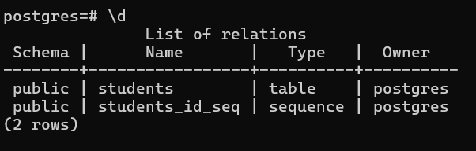
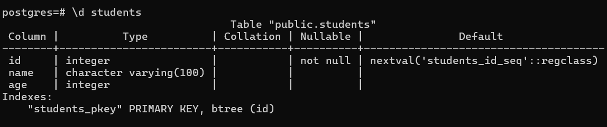

# Viewing Database and Table Structure
Understanding a database structure is important: tables, columns, data types, and relationships.

In PostgreSQL, you can use built-in `psql` commands to explore the structure, or external tools like ER diagrams for visualization.

## \dt and \d commands
`\dt` - shows all tables in current DB.

`\d` *table_name* - describe the exact table structure.

## ER diagrams
ER diagrams are graphical representation of database structure.

**How to view ER Digram via pgAdmin?** 
DB section → Schemas → Tables → Right click → ERD for database